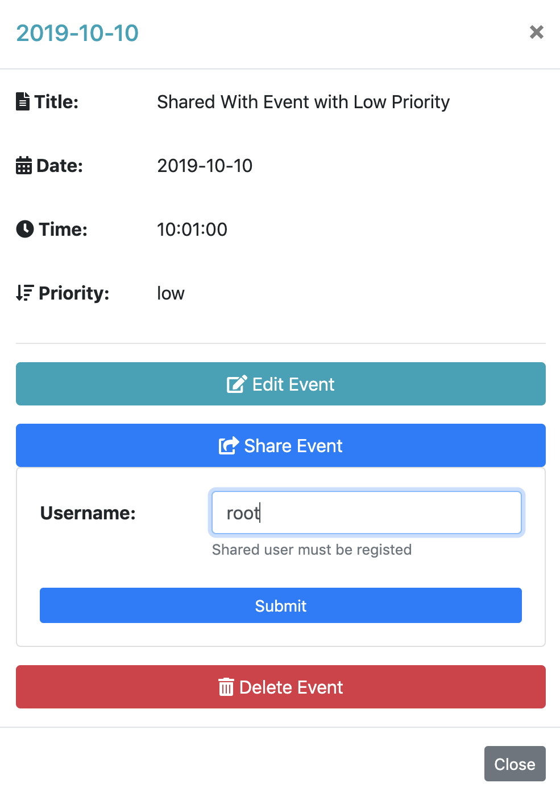
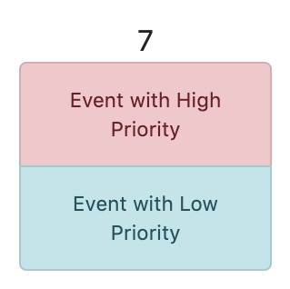
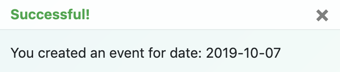
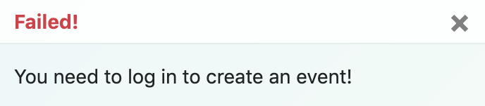
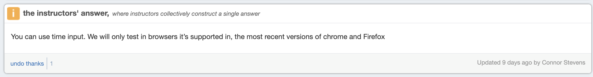

# CSE330

467511

## Module 5: Group - AJAX Calendar

### Link: http://ec2-3-81-107-156.compute-1.amazonaws.com/~saulet/washucalendar/

## Overview:

AJAX Calendar allows you to create/edit/delete/share events. To use these actions, you need to register first, and then log in. All actions are performed over AJAX, without ever needing to reload the page. Refreshing the page does not log a user out.

## How to use:

-   **Register:** Click to "Authorization" button. Fill out the form by providing "username" and "password"
-   **Login:** Click to "Authorization" button. Fill out the form of already registered "username" and "password"
-   **Create Event:** Click to any day, where you want to add an event and then "Create Event" modal pops up. Fill out the form by providing: "title", "time" and "priority" --> Click to "Submit"
-   **Edit Event:** Click to created event that pops up a modal. Click to "Edit Event" --> Change "Title", "Time" and "Priority" --> Click to "Submit"
-   **Delete Event:** Click to created event that pops up a modal. Click "Delete Event"
-   **Share Event:** Click to created event that pops up a modal. Click "Share Event" --> Provide "username" --> Click "Submit"
-   **Logout:** When you log in, the navigation link of "Authorization" would be changed to "Logout". To logout, click to "Logout" button

## Creative Portions:

1. **Users can share events with additional users** - Click to created event that pops up a modal. From there, click to "Share Event" button, and then provide username _(Note: shared username must be registered)_

    

2. **Users can create or edit events based on priority** - When a user creates an event, the event could be 'high' or 'low' priority ('red' and 'green' color respectively). High priority event would be always placed at the top. It is said that nobody is too busy, it's just a matter of priorities. By doing this, it helps to focus on more important things and prioritize events.

    

3. **Animated jQuery Notifications** - Whenever action is triggered such as register/login/create/edit/share/delete/logout, animated notification pops up. These notifications help to inform users about what is going on. Notifications pops up whether it is failed or succeeded!

    
    

## Notes about W3C validator:

-   I have two warnings of using time type for input html tag. In [piazza](https://piazza.com/class/jzoo115n7oz3d6?cid=499), the head of TA (Connor Stevens), allowed to use time input. Therefore, please do not take points off because of using time input. Thanks!

    

### Author

-   Saulet Yskak
